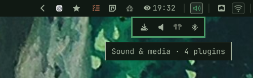
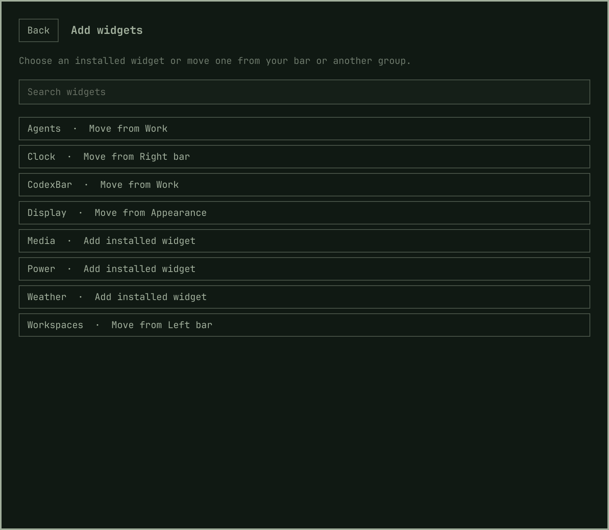
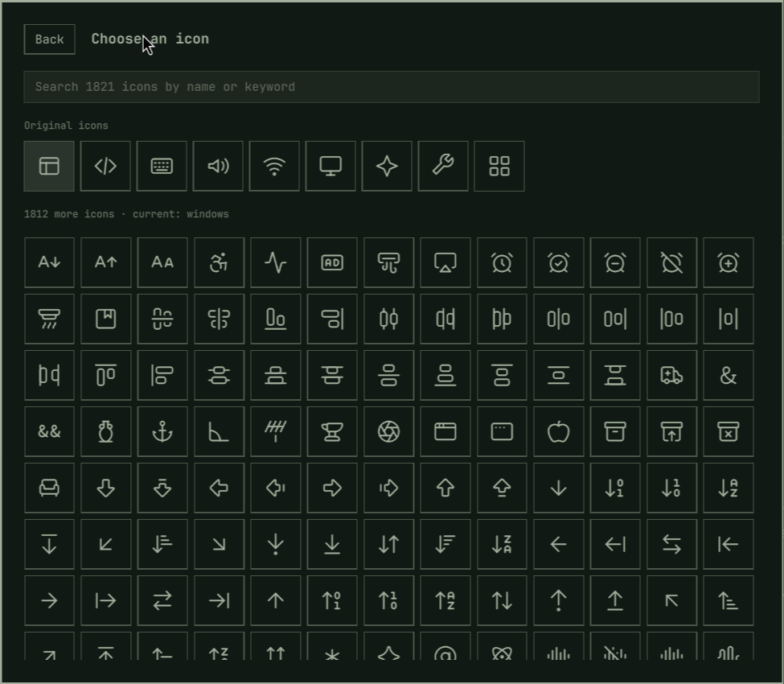
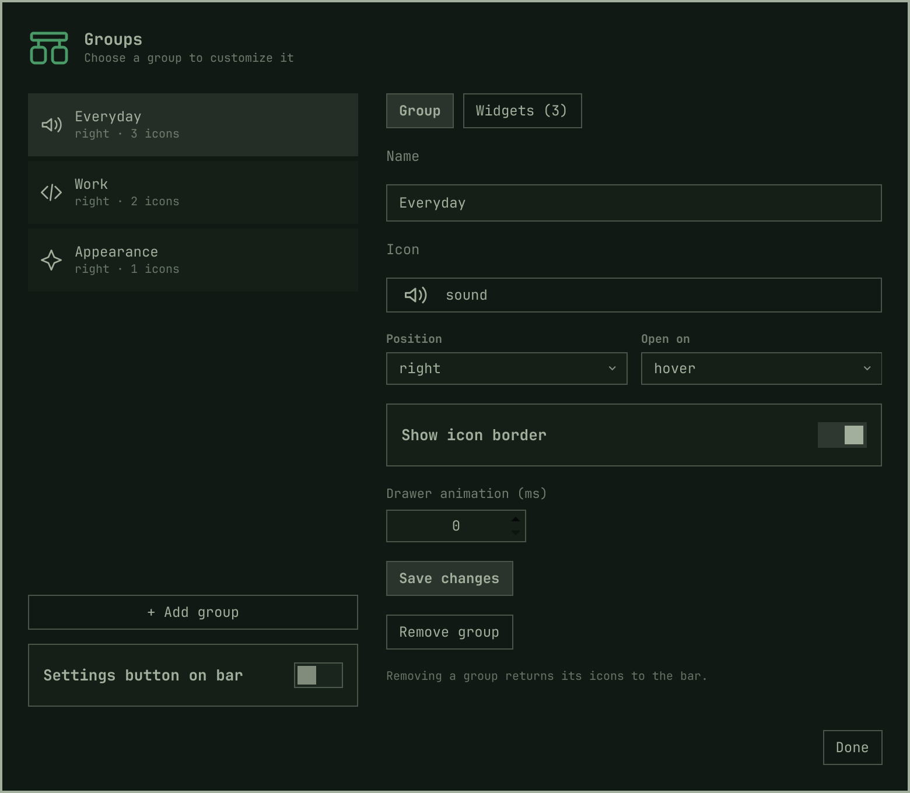
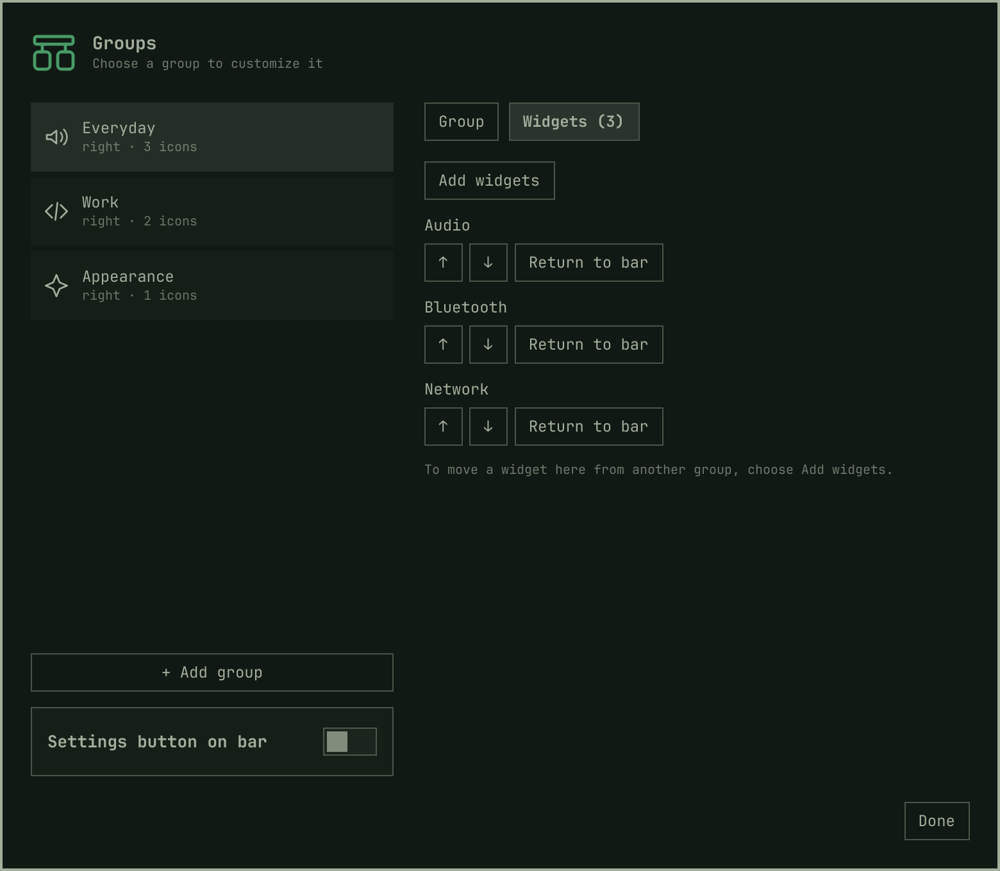

# Groups for Omarchy

Organize your Omarchy bar into independent icon groups. Drawers open below the bar, so your other icons stay in place. Drag widgets into groups, back onto the bar, or directly between groups.



## Highlights

- **Independent groups.** Give each drawer a name, icon, and stable identity. Place groups on the left, center, or right.
- **A steady bar.** Drawers open below the bar without pushing other icons around.
- **Drag and drop.** Move widgets between the bar and groups, reorder inside a drawer, or transfer directly between groups. Widget settings stay with the icon.
- **Native interactions.** Hosted plugins keep their hover tooltips, right-click actions, scrolling, and popup panels.
- **Hover or click.** Hover opens a drawer; click pins it. Click again or outside to dismiss.
- **Built for Omarchy.** Uses the shell's active theme and existing plugin widgets, with no extra background service.

## Requirements

- Omarchy Quattro with the native shell plugin system
- The standard Omarchy bar

The underlying Quickshell and Hyprland support ships with Omarchy. The top bar is the supported and verified configuration.

## Install

```sh
omarchy plugin add https://github.com/kristofferR/omarchy-groups.git --enable
```

Click the new empty group to open settings. Give it a name, choose an icon, and save. In **Widgets**, choose **Add widgets** to select installed widgets or move them from the bar or another group. You can also drag existing bar icons directly onto a group.

Use **Add group** to create more empty groups. Group identities and plugin enablement are managed automatically. A fresh install uses your existing bar and creates no preset groups.



The searchable icon picker includes the original group icons and the bundled Lucide catalog. Search by name or keyword, such as `bluetooth`, `music`, or `rocket`. Icons work offline, and existing icon names stay compatible.



### Update

```sh
omarchy plugin update kristofferr.groups --yes
```

### Remove

Drag the icons you want to keep back onto the bar first, then:

```sh
omarchy plugin remove kristofferr.groups --yes
```

## Controls

| Action | Result |
| --- | --- |
| Hover a group | Open its drawer |
| Click a group | Pin it open; click again to close |
| Click an empty group | Open its settings and add widgets |
| Click outside | Dismiss the drawer |
| Right-click a group | Open Groups settings |
| Drag a bar icon onto a group | Move it into the drawer |
| Drag within a drawer | Reorder icons |
| Drag to another group | Transfer the widget and its settings |
| Drag to a position on the bar | Place the widget there |
| Drop outside the bar and drawers | Cancel the move |

Opening another group closes the previous drawer and its child panel. A widget's own panel keeps its group open while in use. Nested groups are not supported.

## Settings



Right-click a group to edit that group in the shared settings panel. Everything needed to organize groups is available here:

- **Group:** edit the name, search for an icon, choose left/center/right placement and hover/click opening, toggle the icon border, and set the drawer animation duration. Zero means instant. Press **Save changes** to apply.
- **Widgets:** add installed widgets, move widgets here from another group or bar section, move them up or down, or return them to the bar. These changes save immediately and preserve widget settings.
- **Add group:** create another empty group with its own identity.
- **Remove group:** return the group's widgets to its bar section. Removing the last group leaves a settings button on the bar so you can create groups again.
- **Settings button on bar:** show or hide a dedicated settings shortcut. It stays visible while there are no groups.

Groups can also be dragged along the bar. Escape, Done, or clicking outside closes settings. Use Groups' own settings panel for its individual drawers.



### Optional terminal controls

The UI handles setup and organization; these commands are available for shortcuts and automation. Open settings with:

```sh
omarchy-shell shell summon kristofferr.groups
```

Groups also expose independent IPC controls:

```sh
omarchy-shell kristofferr.groups.devices open
omarchy-shell kristofferr.groups.devices close
omarchy-shell kristofferr.groups.devices toggle
omarchy-shell kristofferr.groups.devices status
omarchy-shell kristofferr.groups.devices absorb omarchy.network
omarchy-shell kristofferr.groups.devices eject omarchy.network
omarchy-shell kristofferr.groups.devices reorder 0 2
```

Replace `devices` with the group ID reported by `omarchy-shell kristofferr.groups.settings-panel status`. The `eject` command places the widget beside its group; dragging lets you choose the position.

## Development

```sh
./validate
./install-local.sh
```

Validation runs layout tests, Qt 6 lint, the Quickshell harness, shell syntax checks, and manifest validation when Omarchy is installed. The local installer copies runtime files into the user plugin directory and restarts the shell to clear cached QML components. It does not change the layout.

See [development notes](docs/development.md) for optional live pointer tests, hosting limitations, and the original base/separator comparison.

## Security and system changes

Groups runs inside Omarchy Shell with your user's permissions. Moving widgets updates `~/.config/omarchy/shell.json`, including the plugin enablement entries required by hosted widgets. It does not install packages or change Hyprland configuration. Hosted plugins retain their own behavior and permissions.

## Troubleshooting

- **Empty drawer:** click it, then choose **Widgets → Add widgets**, or drag an icon onto the group.
- **Widget missing:** verify the plugin is installed and enabled. Some plugins hide their icon while idle or when hardware is absent.
- **Changes do not appear:** run `omarchy plugin validate .` in the checkout. After replacing plugin code manually, restart the shell with `omarchy restart shell` to clear cached hosted components.
- **Several groups behave unexpectedly:** reopen Groups settings. Missing or duplicate group identities are repaired automatically, preserving names and contents.

## Credits

Based on [Nook](https://github.com/Katsari/nook) by Katsari, starting from version 1.1.2. Its widget hosting, panel anchoring, scrolling, original drag handling, and Git history are preserved.

The additional icon catalog comes from [Lucide](https://lucide.dev), bundled at a pinned revision. Its ISC/MIT notices are included in [assets/LICENSE-lucide.txt](assets/LICENSE-lucide.txt). Regenerate it with `uv run --no-project python scripts/update-icons.py`.

## License

MIT for the plugin. Bundled Lucide icons retain their ISC/MIT licenses.
